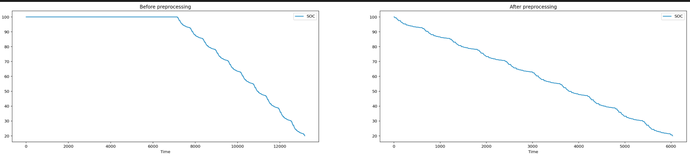
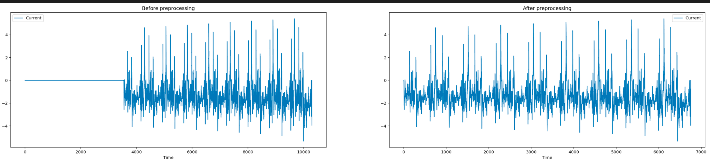
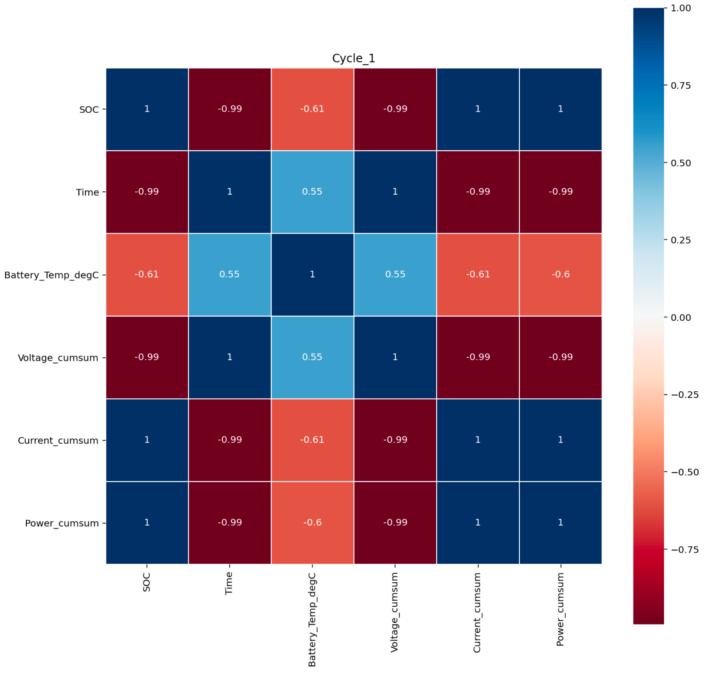
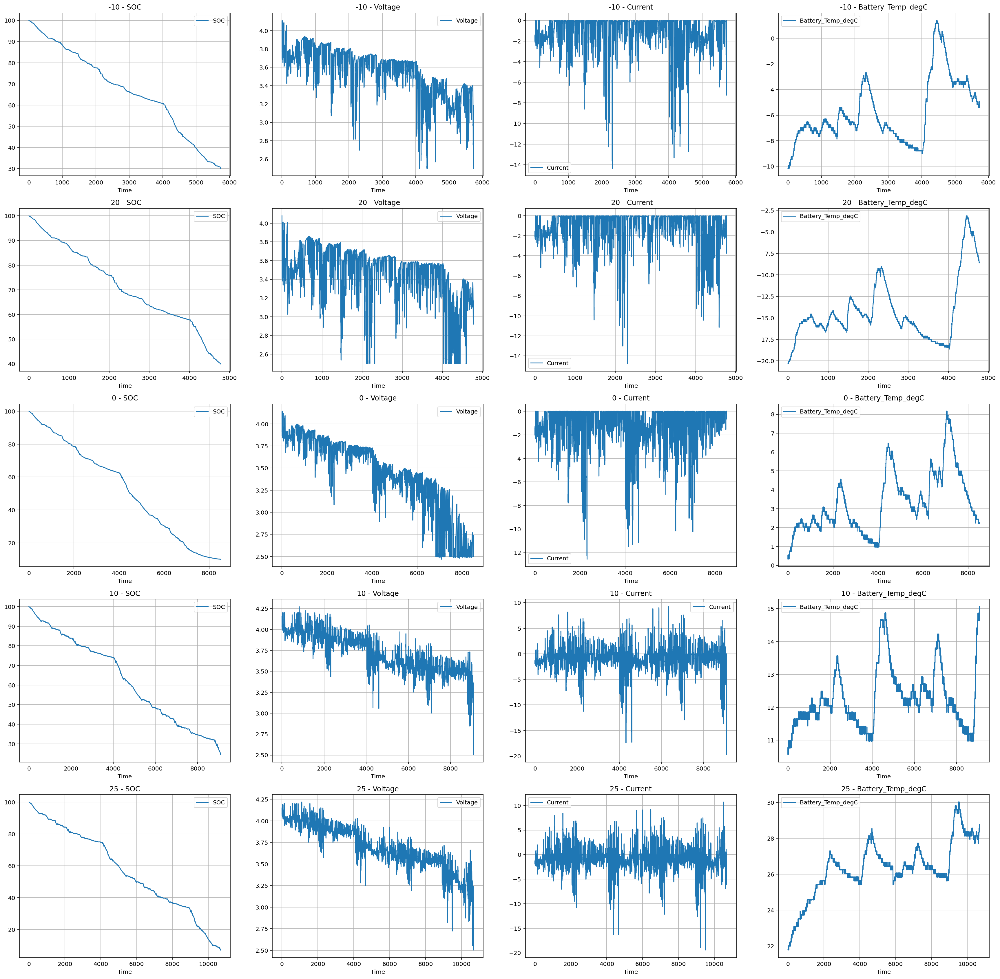

みなさまお疲れ様でした！  
以下に簡単にですが解法を記載します。ご質問などございましたが、コメントいただければと思います。  
最終submissionのコードはこちらで公開しています。  
https://github.com/takumiw/nishika16_2nd_solution

# 概要
- 温度条件ごとに、ドライブサイクルをグループとしたGroupKFoldで交差検証を実施
- Current (電流の計測値) の累積和のみを特徴量として、線形回帰モデルでSOCを予測
- 評価指標: RMSE
- CV: 0.032757
- 暫定スコア: 0.046750 (101位)
- 最終スコア: 0.021695 (2位)

# 前処理
## 学習データ
1. 学習データには、下図のように明らかに実験開始前の余分な箇所が含まれている場合があります (SOCが100の連続した部分)。このような箇所はモデルの学習に不必要であると考え、前処理の段階で取り除きました。

## テストデータ
1. テストデータは、複数の実験データを結合した1つのファイルからなっています。このままだと扱いづらいため、`Time`のカラムを利用して、学習データと同じように実験ごとのファイルに分割します。

2. 学習データと同じように、テストデータにも実験開始前の余分な箇所が残ったままになっています。テストデータの場合は、`Current`のカラムが0のまま変動していない部分を実験開始前の余分な部分であると考え、学習データと同じように前処理の段階で取り除きました。(submissionファイルの作成時には、取り除いた部分のSOCは100で埋めています。)

# 特徴量生成
特徴量生成に関しては、colum2131さんの[こちら](https://www.nishika.com/competitions/16/topics/117)のディスカッションを参考に、`Current` (電流の計測値) の累積和と`Power` (電力値) の累積和の2種類の特徴量を作成しました。  

また、電流の計測値の累積和のみを特徴量とした場合と、電流の計測値の累積和と電力値の累積和の両方を特徴量とした場合の2パターンを最終提出としましたが、電流の計測値の累積和のみを特徴量として利用した場合の方が最終スコアが高い結果となりました。  

電流の計測値の累積和のみを利用
- CV: 0.032757
- 暫定スコア: 0.046750
- 最終スコア: 0.021695  

電流の計測値の累積和と、電力値の累積和の両方を利用
- CV: 0.024440
- 暫定スコア: 0.053243
- 最終スコア: 0.024440

# 交差検証
下図のように同じドライブサイクルでも温度条件によって観測値 (特に`Current`と`Battery_Temp_degC`) の傾向に差があったため、温度条件ごとにモデルを作りました。また、学習データとテストデータでドライブサイクルの構成が異なっていたため、学習データと検証データでドライブサイクルの被りが発生しないようにGroupKFoldで交差検証しました。 (下図はドライブサイクルが`Cycle_1`のときの例で、上から順に温度条件-10℃、-20℃、0℃、10℃、25℃です)

# モデル
特徴量と線形な相関があったため、シンプルに線形回帰 (`sklearn.linear_model.LinearRegression`) を利用しました。